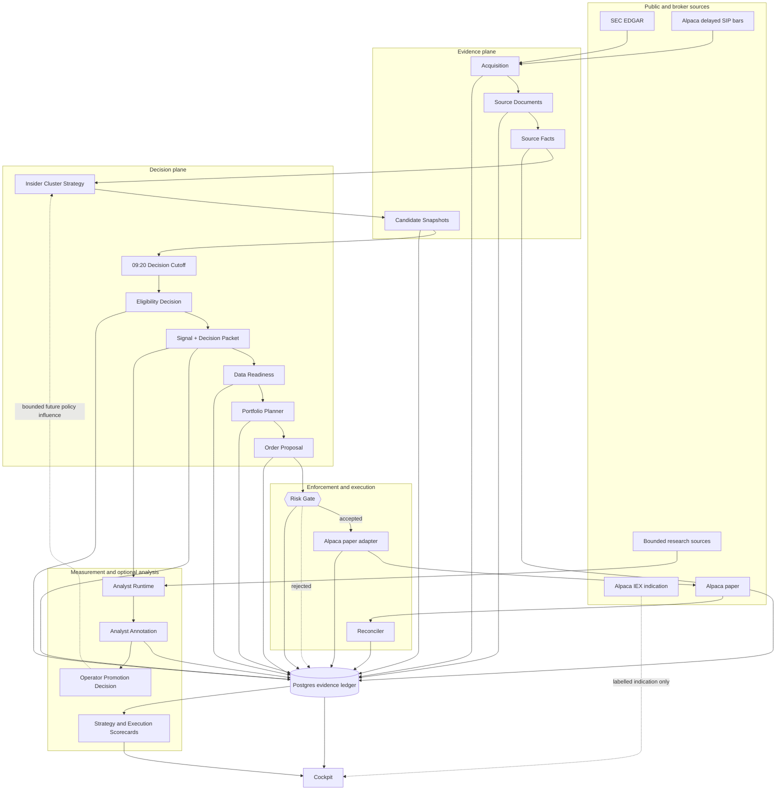

# Architecture

Sonde is a point-in-time evidence system that happens to paper-trade. Its architectural product is
an immutable explanation of what it acquired, knew, concluded, declined, proposed, executed, and
later learned.

The active scope is deliberately narrow: one deterministic insider-cluster strategy, US-listed
common equities, one Alpaca paper account, one Postgres database, and one private operator.

## System shape



The risk gate is a hard seam: `packages/risk` cannot import the Analyst Runtime, a venue adapter, or
network clients. The model never creates an Order Proposal and never reaches execution. Strategy
V1 does not require a model at all.

## Planes

### Evidence

Acquisition adapters fetch configured Candidate Sources. Every real request appends an Acquisition
Attempt. Exact returned bytes become a content-addressed Source Document before parsing. Parsers
emit typed Source Facts for all relevant source content, including Form 4 transactions Strategy V1
does not use.

Facts retain their domain-specific Source Clocks—SEC acceptance time and transaction date are not
the same event—and their `observedAt` and `recordedAt` Knowledge Clocks. Derived artifacts use typed
Input References. Evidence Relations such as `supports`, `undercuts`, and `propagation` add meaning
without replacing exact computation inputs.

SEC CIK identifies an Issuer. Effective-dated Listings and Broker Assets map that issuer to a
tradable security and Alpaca identifier. Ticker is an attribute, never identity.

### Decision

The Insider Cluster Strategy consumes Source Facts and appends Candidate Snapshots. A Candidate is
eligible when at least two distinct reporting-owner CIKs filed qualifying code-`P` purchases for the
same liquid Issuer in the same Decision Window.

At 09:20 America/New_York on an executable session, the strategy closes the window. It appends one
Eligibility Decision and at most one final Signal, then freezes a Decision Packet naming every
versioned input used. Late facts belong to the next Decision Window.

The Signal is a prospective market claim, not an order. It always resolves from the next
regular-session open through the close twenty subsequent sessions later, whether Sonde traded it or
not.

Data Readiness checks the exact calendar, universe, SIP data, source completeness, portfolio, and
broker reconciliation needed for an entry. The Portfolio Planner appends a Planning Decision for
every eligible Signal and creates an Order Proposal only while Active and ready. Reasons such as
`already_held`, `below_minimum_order`, and `not_ready` remain part of the forward evidence.

### Enforcement and execution

The Risk Gate is deterministic and side-effect free. Its interface accepts an immutable Order
Proposal and risk snapshot and returns an accepted or rejected Risk Decision with reasons. It owns
position, sector, daily-loss, rate, price, operational-state, kill-switch, and dead-man checks; it
does not fetch missing inputs or submit an order.

The Alpaca adapter is paper-only. Entry uses whole-share market-on-open orders after the 09:20
cutoff and before Alpaca's 09:28 deadline. The 1% Sizing Target is floored to whole shares. Partial
auction fills stand and are never chased. A post-fill exposure above 1.25% enters Halted without
automatic liquidation.

Normal exit is a market-on-close order on the horizon session, staged before 15:50. Rejected,
unfilled, or fractional-residue cases follow the deterministic fallback until flat and append an
Execution Exception.

Broker trade updates make the cockpit immediate. REST reconciliation at startup, before market
actions, after ambiguous calls, after auctions, and periodically remains authoritative. Recovery is
query-first and uses deterministic client-order identities before retrying.

### Measurement and analysis

Every final Signal enters the Strategy Scorecard. The primary metric is median Signal Excess Return
against the date-matched point-in-time eligible-universe median. Raw returns, hit rate, tails,
resolution coverage, SIC and SPY comparisons, and Unresolvable Outcomes remain visible.

The Execution Scorecard separately reports broker equity, time-weighted return, P&L, drawdown,
exposure, turnover, fill variance, and versioned Realism Outcomes. Paper fills, canonical Signal
Outcomes, and estimated realism never overwrite one another.

Milestone 6 introduces one pinned Analyst Runtime behind a Sonde-owned interface. Deterministic code
bounds the evidence, then one high-quality model call emits an Analyst Annotation. Requests,
responses, validation, usage, latency, and failures are immutable. The runtime exposes no venue,
control, database-write, or general network tool.

Analyst behavior is forward-scored in sealed Evaluation Epochs. Only authenticated Promotion
Decisions can grant confidence, eligibility-reduction, or sizing-reduction influence, one capability
at a time. Initial model influence can only veto or reduce the deterministic baseline.

### Operations and presentation

One engine process contains an ordinary scheduled lane and an isolated priority market-action lane.
They coordinate through durable Postgres state; there is no internal queue broker. Ordinary
acquisition or reconciliation work cannot delay a cutoff or auction action.

The private cockpit is operations-first: state and readiness, market clock and next action, alerts,
candidate funnel, decision tape, positions, exposure, and scorecard summaries. Server-Sent Events
carry resumable event references; REST snapshots render authoritative state.

The Event Console is read-only. Its command palette exposes only authenticated, durable Operator
Commands. It has no shell or order ticket. The in-app alert inbox is canonical; Telegram receives
urgent operational alerts.

## Deep module seams

The target modules hide policy and lifecycle complexity behind small interfaces. The interface is
also the test surface.

| Module             | Interface responsibility                                                   | What remains inside                                                                                            |
| ------------------ | -------------------------------------------------------------------------- | -------------------------------------------------------------------------------------------------------------- |
| Acquisition        | Run one configured source acquisition and return its durable outcome       | Rate policy, conditional requests, byte storage, parse lifecycle, retries                                      |
| Strategy V1        | Advance candidates from Source Facts; close one Decision Window            | owner deduplication, calendar assignment, liquidity policy, snapshots, eligibility, Signal and packet creation |
| Data Readiness     | Assess one proposed action against one versioned policy                    | freshness, completeness, entitlement, reconciliation, reason codes                                             |
| Portfolio Planner  | Turn one eligible Signal and portfolio snapshot into one Planning Decision | held-name handling, whole-share sizing, operating state, promoted reductions                                   |
| Risk Gate          | Decide one immutable proposal against one risk snapshot                    | all deterministic limits and typed rejection reasons                                                           |
| Venue              | Submit, cancel, and reconcile paper execution intent                       | Alpaca protocol, client IDs, ambiguity recovery, broker event normalization                                    |
| Outcome Resolver   | Resolve due Signals and execution histories                                | calendar horizon, corporate actions, benchmarks, unresolvable reasons, realism methods                         |
| Analyst Runtime    | Annotate one bounded evidence packet                                       | provider call, exact versioning, validation, immutable telemetry, failure handling                             |
| Cockpit Read Model | Produce authoritative snapshots and resumable event references             | projections, filtering, lineage joins, alert state                                                             |

Source, venue, and model dependencies are true external seams: production adapters and controlled
test adapters satisfy the same narrow interfaces. Postgres is local-substitutable in tests; database
details do not leak into the domain interfaces.

## Evidence ledger

All authoritative history is append-only. Mutable tables are disposable projections or broker-state
caches, never evidence.

| Artifact                                           | Purpose                                                | Mutation                 |
| -------------------------------------------------- | ------------------------------------------------------ | ------------------------ |
| Acquisition Attempt                                | One source request and response outcome                | Append-only              |
| Source Document                                    | Exact bytes, hash, media type, parser provenance       | Immutable                |
| Source Fact                                        | Typed statement parsed from one document               | Append-only              |
| Candidate Snapshot                                 | Candidate after one evidence or policy transition      | Append-only              |
| Eligibility Decision                               | Strategy-policy inclusion or exclusion                 | Append-only              |
| Signal and Decision Packet                         | Prospective claim and exact decision manifest          | Append-only              |
| Data Readiness                                     | Decision-specific completeness and freshness result    | Append-only              |
| Planning and Risk Decisions                        | Proposed or declined action and deterministic judgment | Append-only              |
| Order, Execution Event, reconciliation observation | Paper broker intent and truth                          | Append-only              |
| Signal, Execution, and Realism Outcomes            | Three distinct result series                           | Written once per version |
| Analyst artifacts and Promotion Decisions          | Model behavior, evaluation, and operator authority     | Append-only              |
| Operational Event, Alert, and Command              | Runtime and control history                            | Append-only              |

Materialized candidate, position, health, and cockpit projections may be rebuilt from these records.

## Point-in-time and replay

Forensic Replay uses the exact Input References and versions captured by a Decision Packet. For an
LLM call, the preserved request and response are historical truth; a fresh sample is not replay.

Reconstruction Replay is explicitly separate. It may use corrected or newly fetched inputs and
shows field-level differences from the forensic record. Neither replay mode mutates the original
decision or outcome.

Authoritative prices, quantities, money, ratios, and returns cross domain interfaces as validated
decimal strings or scaled integers and persist as database decimals. JavaScript numbers are limited
to labelled non-authoritative statistics or display.

## Market data

Delayed consolidated SIP daily bars are authoritative for eligibility, prior-close inputs, and
Signal Outcomes. Sonde verifies the account entitlement and fails readiness if SIP is unavailable;
it never silently substitutes IEX. Real-time IEX may appear only as a labelled operational
indication. Broker fills remain authoritative for execution.

## Deployment

Through paper execution, Sonde runs on one always-on machine with separately supervised engine and
web processes and colocated plain Postgres. Before Milestone 4 it must restart automatically, keep a
synchronized clock, disable sleep, and reconcile at startup.

One simple automated backup copy lives outside the active data directory. There is no high
availability, replication, or enterprise recovery program. TimescaleDB waits for measured pressure.
Model usage and cost are recorded and displayed without an automated budget threshold.

The cockpit requires an operator session on loopback. Future remote access uses a private network
and strong single-user authentication; it is never directly public.

## Target repository layout

```text
sonde/
├── apps/
│   ├── engine/       # scheduled and priority lanes; module composition
│   └── web/          # private cockpit, SSE and authenticated controls
├── packages/
│   ├── core/         # Zod schemas and domain primitives
│   ├── probes/       # source acquisition and parsing adapters
│   ├── strategy/     # Insider Cluster Strategy V1
│   ├── planning/     # deterministic Portfolio Planner and Data Readiness
│   ├── risk/         # deterministic Risk Gate
│   ├── venue/        # Alpaca paper adapter and reconciliation
│   ├── scoring/      # outcome resolution, benchmarks, scorecards
│   ├── agents/       # pinned Analyst Runtime, introduced at Milestone 6
│   └── db/           # Postgres schema, transactions, projections
└── docs/
```

This is the target layout. The Milestone 0 schemas and packages are intentionally disposable where
they contradict the accepted ADRs and specs.
