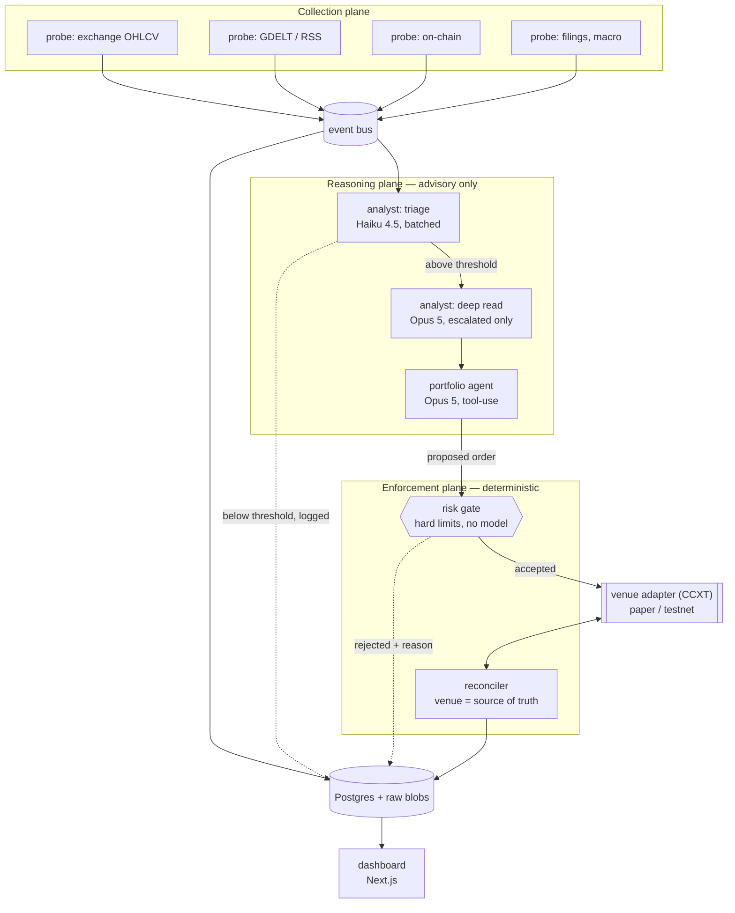

# Architecture

## The shape of the thing

Sonde is four planes with one hard boundary between the third and fourth. Everything upstream of
the risk gate is advisory. Everything downstream is deterministic.



**The boundary is the whole design.** A model that hallucinates, misreads a headline, or is
prompt-injected by hostile text in a news article can propose whatever it likes. It emits a typed
order proposal into a function it does not control. That function checks position caps, daily loss
limits, order rate, and sanity bounds, and returns accept or reject-with-reason. Both outcomes are
stored and rendered. See [ADR 0005](./decisions/0005-llm-proposes-code-disposes.md).

## Planes

### 1. Collection

Probes are small, independent, single-purpose collectors. Each one normalizes its output to a
common envelope and publishes to the bus. A probe never interprets, never scores, never trades — it
fetches, normalizes, deduplicates, and timestamps.

Every raw payload is persisted before any processing, keyed by content hash. This gives us
replayability: any pipeline change can be re-run against the exact bytes the original run saw.

Two timestamps on every observation, always:

- `observed_at` — when Sonde saw it
- `occurred_at` — when the underlying event happened (publisher timestamp, block time, bar close)

Analysts are only ever shown data where `observed_at <= now`. This is enforced in the query layer,
not by convention.

### 2. Reasoning

The reasoning plane converts observations into typed `Signal` records. A signal is:

```ts
type Signal = {
  id: string;
  asset: string;
  direction: "long" | "short" | "flat";
  confidence: number; // 0..1, calibration tracked over time
  horizon: string; // ISO 8601 duration, e.g. "PT4H"
  rationale: string; // the model's own words
  sourceIds: string[]; // provenance — every document that fed this
  analyst: string; // prompt + model version that produced it
  createdAt: string;
};
```

`rationale` and `sourceIds` are not optional. A signal without a traceable cause is a bug
([ADR 0008](./decisions/0008-append-only-signal-log.md)).

Two tiers, because inference is the only real cost:

- **Triage** (Haiku 4.5) — batched, scores many items per call, filters aggressively.
- **Deep read** (Opus 5) — only for items that clear the triage threshold.

See [ADR 0007](./decisions/0007-tiered-model-routing.md) for routing and caching.

### 3. Enforcement

The risk gate is plain TypeScript with no model in the path. It owns:

| Check                | Behaviour on breach            |
| -------------------- | ------------------------------ |
| Max position size    | Reject order                   |
| Max daily loss       | Halt all trading until reset   |
| Max orders per hour  | Reject order                   |
| Price sanity bounds  | Reject order                   |
| Kill switch (manual) | Halt, flatten nothing          |
| Dead-man's switch    | Halt if no heartbeat in N mins |

The reconciler treats the venue as authoritative
([ADR 0009](./decisions/0009-venue-is-source-of-truth.md)). Local state is a cache that gets
corrected, never a ledger that gets trusted. Orders carry client-generated idempotency keys so a
crash between submit and record cannot double-fill.

### 4. Presentation

A Next.js dashboard, read-mostly, over the same Postgres. The surfaces that matter:

- **Live tape** — signals and orders as they happen, each expandable into its full reasoning trail
- **Trade detail** — source documents → analyst rationale → proposed order → gate decision → fill
- **Analyst scoreboard** — realized hit rate and calibration per source, per analyst, per prompt version
- **Blocked** — what the risk gate rejected and why, which is often more interesting than the fills
- **Cost** — token spend by tier and by probe, against budget

## Storage

Single Postgres instance. TimescaleDB extension if and when bar volume justifies it — not before.

| Table            | Holds                                   | Mutability   |
| ---------------- | --------------------------------------- | ------------ |
| `raw_documents`  | Content-hashed original payloads        | Immutable    |
| `observations`   | Normalized probe output                 | Immutable    |
| `signals`        | Analyst output with rationale + sources | Append-only  |
| `signal_results` | Resolved outcome at horizon             | Written once |
| `proposals`      | Portfolio agent order proposals         | Append-only  |
| `gate_decisions` | Accept/reject with reason               | Append-only  |
| `orders`         | Submitted orders, idempotency keys      | Append-only  |
| `fills`          | Venue-reported executions               | Append-only  |
| `positions`      | Reconciled snapshot                     | Mutable      |
| `runs`           | Process lifecycle, heartbeats           | Append-only  |

Nothing in the signal or decision path is ever updated in place. The audit trail is the product.

## Cost model

Venue cost is zero by construction — paper and testnet accounts
([ADR 0003](./decisions/0003-paper-first-execution.md)). Inference is the only recurring spend.

Current per-million-token pricing:

| Model     | Input | Output | Role                       |
| --------- | ----- | ------ | -------------------------- |
| Haiku 4.5 | $1    | $5     | Triage, extraction         |
| Sonnet 5  | $3    | $15    | Optional middle tier       |
| Opus 5    | $5    | $25    | Deep read, order proposals |

Budget target: **under $30/month** at an event-driven cadence. Three levers, in order of impact:

1. **Event-driven, not polling.** Wake on an actual event, not a timer. Cheaper and better trading
   logic at the same time ([ADR 0006](./decisions/0006-event-driven-cadence.md)).
2. **Tiered escalation.** Haiku filters; Opus only sees what survives.
3. **Prompt caching.** Stable prefix (system prompt, strategy rules, portfolio state) is cached at
   ~0.1× input price; volatile content goes last, after the cache breakpoint.

> **Caching gotcha to design around from day one.** The minimum cacheable prefix is model-dependent
> and not monotonic: **512** tokens on Opus 5, **1024** on Sonnet 5, but **4096** on Haiku 4.5. A
> short triage prompt on Haiku silently will not cache — no error, `cache_read_input_tokens` just
> stays zero. Batching many items into one Haiku call clears the floor and cuts per-item cost at the
> same time.

For research workloads — scoring a historical corpus to build an evaluation set — the Batch API is
50% off and completes within the hour.

## Repository layout

```
sonde/
├── apps/
│   ├── engine/        # the loop: probes, analysts, gate, reconciler
│   └── web/           # Next.js dashboard
├── packages/
│   ├── core/          # domain types, Signal/Proposal/Order schemas (Zod)
│   ├── probes/        # collectors, one module per source
│   ├── agents/        # analyst + portfolio prompts, model routing
│   ├── risk/          # the gate — deterministic, heavily tested
│   ├── venue/         # CCXT adapter, idempotency, reconciliation
│   └── db/            # schema + migrations
└── docs/
```

`packages/risk` has no dependency on `packages/agents`. That is enforced by the dependency graph,
not by discipline — the gate must not be able to import a model.

## Runtime

One long-lived process (`apps/engine`) plus the Next.js app. No queue broker initially; the event
bus is an in-process emitter with a Postgres-backed outbox for durability. If that stops being
enough, the outbox is already the seam to put a real broker behind.

Deployment target for the engine is a small always-on box — it needs to hold WebSocket connections
and its own scheduling. The dashboard can go anywhere.
