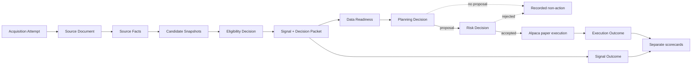

# Sonde — system overview

Sonde watches point-in-time public information, emits deterministic market claims, paper-trades the
eligible ones, and preserves an inspectable record of the entire path. Its primary goal is a system
worth operating and watching, not a claim of profitable trading.

The authoritative detail lives in [`architecture.md`](./architecture.md), the
[`strategy/`](./strategy) charter, the [specs](./specs), and the [ADRs](./decisions).

## What launches first

Strategy V1 is narrow and measured:

- US-listed common equities only;
- long only;
- at least two distinct Section 16 reporting-owner CIKs making qualifying Form 4 code-`P`
  purchases in the same Issuer and Decision Window;
- median 20-session dollar volume above $20m;
- one final Signal per Issuer and Decision Window at 09:20 America/New_York;
- canonical outcome from the next regular-session open through the close twenty subsequent
  sessions later.

Historical out-of-sample evidence found a +1.83% median 20-session return and 58.3% win rate for the
liquid multi-insider cohort, against +0.10% and 50.4% for liquid stocks on the same dates. Those
figures are a Bootstrap Prior, not event confidence and not a profitability claim. Forward Signals
are the evidence that matters now.

## End-to-end path

Every box is immutable or append-only. Typed Input References bind derived decisions to the exact
artifacts they consumed. The cockpit is a view over this evidence spine, not a second source of
truth.

## What happens at the open

Facts sharing the same next executable regular-session open form a Decision Window. As filings
arrive, Sonde appends Candidate Snapshots; it does not mutate one current candidate.

At 09:20 ET:

1. Strategy V1 freezes the final Candidate Snapshot.
2. It appends an Eligibility Decision and at most one Signal.
3. A Decision Packet captures the exact strategy, policy, calendar, universe, SIP data, candidate,
   readiness-policy inputs, portfolio, and model versions available.
4. Data Readiness checks whether action-specific inputs are complete, current, entitled, and
   reconciled.
5. The deterministic Portfolio Planner records either a no-proposal reason or a whole-share Order
   Proposal targeting 1% of paper equity.
6. The Risk Gate accepts or rejects the proposal without fetching data, calling a model, or touching
   a broker.
7. An accepted proposal reaches Alpaca paper as a market-on-open order before 09:28.

Partial auction fills stand; Sonde never chases after the open. A fill above 1.25% of paper equity
enters Halted for operator review without automatic liquidation.

Normal exit is a market-on-close order on the horizon session. Execution failures follow a
deterministic recorded fallback until the paper position is flat. The canonical Signal Outcome
still uses the defined open-to-horizon-close convention, independent of broker behavior.

## Operational states

| State      | New entries        | Position management                  | Meaning                              |
| ---------- | ------------------ | ------------------------------------ | ------------------------------------ |
| Active     | Allowed when ready | Continues                            | Normal operation                     |
| Paused     | Blocked            | Continues                            | Operator-requested pause             |
| Degraded   | Blocked            | Continues                            | Required data is stale or incomplete |
| Halted     | Blocked            | Risk-reducing actions continue       | Safety or invariant breach           |
| Recovering | Blocked            | Reconciliation and recovery continue | Truth is being rebuilt               |

There is no automatic flatten on a state transition. Resuming entry requires the appropriate
authenticated command, fresh reconciliation, and passing Data Readiness.

## Three truths, three scorecards

Sonde refuses to collapse these into one P&L:

1. **Signal Outcome** — the strategy's canonical counterfactual return, for every final Signal.
2. **Execution Outcome** — the paper broker's actual fills and position result.
3. **Realism Outcome** — a versioned estimate of effects Alpaca paper omits.

The Strategy Scorecard's primary metric is median Signal Excess Return against the date-matched
point-in-time eligible-universe median. Raw returns, hit rate, tails, unresolvable outcomes, and SIC
and SPY comparisons remain visible. The separate Execution Scorecard reports broker equity,
time-weighted return, P&L, drawdown, exposure, turnover, and fill variance.

Every final Signal enters the strategy population, including Signals that were blocked, already
held, operationally unready, or too expensive for one whole share.

## Where the model fits

The model is absent from launch trading. Milestone 6 adds one pinned Analyst Runtime that reads
bounded evidence around existing candidates and emits structured Analyst Annotations:

- `supports`, `undercuts`, or `neutral`;
- probability that the Signal beats its Primary Benchmark;
- magnitude band, uncertainty, rationale, and typed Evidence Relations.

An annotation initially changes nothing. Analyst Behavior Versions are frozen and scored in sealed
forward Evaluation Epochs. Only the authenticated operator can grant confidence, eligibility-
reduction, or sizing-reduction influence after the documented evidence floor. Early promoted
influence can only veto or reduce the deterministic baseline; it cannot create proposals, increase
exposure, or override risk.

If an annotation-only call fails, Strategy V1 continues. If a promoted model capability becomes
part of entry policy, missing or invalid output fails Data Readiness for the affected entry.

## Point-in-time honesty

- SEC CIK identifies an Issuer; effective-dated Listings and Broker Assets identify what trades.
  Ticker is not identity.
- SEC acceptance time, transaction date, market sessions, publication time, `observedAt`, and
  `recordedAt` keep their separate meanings.
- Delayed consolidated SIP daily bars are authoritative for liquidity, sizing inputs, benchmarks,
  and Signal Outcomes. Real-time IEX is a labelled cockpit indication only.
- Authoritative money and quantity use validated decimals, not binary floating point.
- Corporate actions use a documented total-return method. Impossible cases become visible
  Unresolvable Outcomes rather than disappearing.

## Replay

Forensic Replay uses the exact captured Decision Packet and versions. Reconstruction Replay may use
corrected or newly fetched inputs and displays field-level differences. A preserved model request
and response are historical truth; sampling the model again is not replay.

## Cockpit

The private cockpit leads with operating state, readiness, market clock and next action, alerts,
candidate funnel, decision tape, positions, exposure, and scorecard summaries. The Event Console is
a structured read-only lineage viewer, not a shell or order ticket.

Server-Sent Events make new evidence visible immediately; durable REST snapshots remain
authoritative. Operator Commands are authenticated and audited. The in-app alert inbox is canonical,
with Telegram for urgent events.

## Runtime and deployment

One engine process has an ordinary scheduled lane and an isolated priority market-action lane. One
always-on machine runs the supervised engine and web processes with plain Postgres. Before paper
execution, sleep is disabled, clock synchronization is verified, restart is automatic, and startup
reconciliation passes.

The project keeps one simple backup copy outside the live data directory. It does not build high
availability or TimescaleDB speculatively. Model usage and cost are measured and displayed without
an automatic budget cap.

## Milestones

| Milestone         | Outcome                                                                        |
| ----------------- | ------------------------------------------------------------------------------ |
| 0 · Pipe          | EDGAR and SIP evidence flows into immutable lineage and appears in the cockpit |
| 1 · Signal        | Decision Windows close into deterministic Signals and Decision Packets         |
| 2 · Scorekeeping  | Signals resolve against point-in-time benchmarks                               |
| 3 · Gate          | Planner, readiness, risk, and fail-closed states are adversarially tested      |
| 4 · Hands         | Auction-aligned Alpaca paper execution runs unattended                         |
| 5 · Watch         | Replay, scorecards, alerts, and forensics make the cockpit worth opening       |
| 6 · Corroboration | One pinned analyst annotates candidates and is scored separately               |
| 7 · Iterate       | Sealed epochs and operator Promotion Decisions grant bounded influence         |

Observable exit criteria live in [`roadmap.md`](./roadmap.md).
