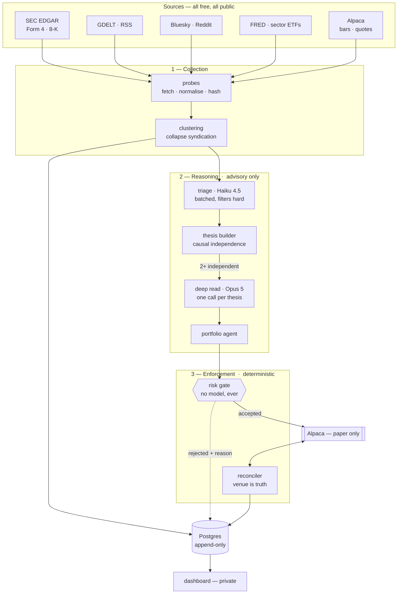
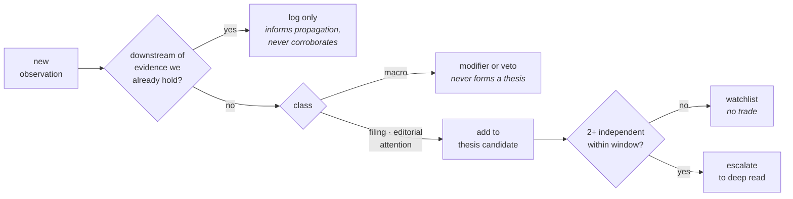
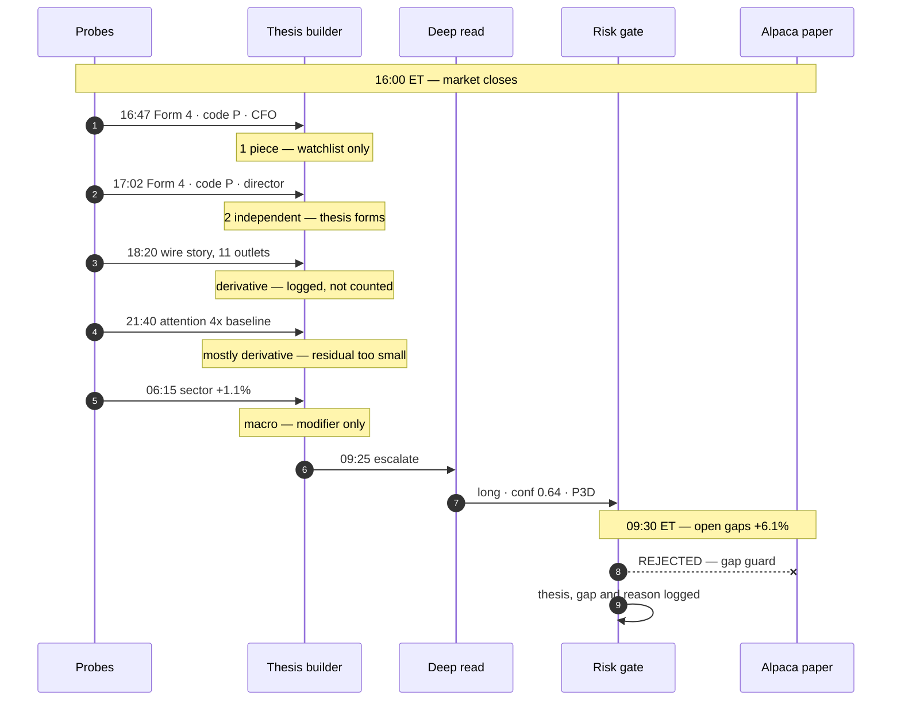
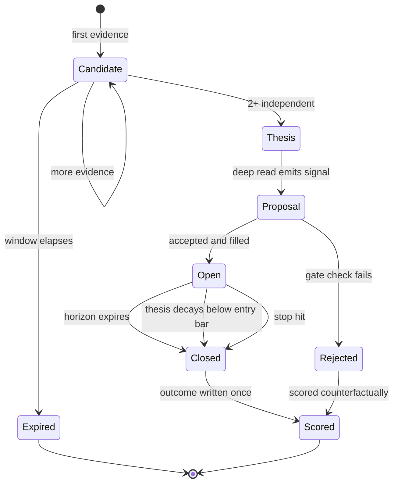
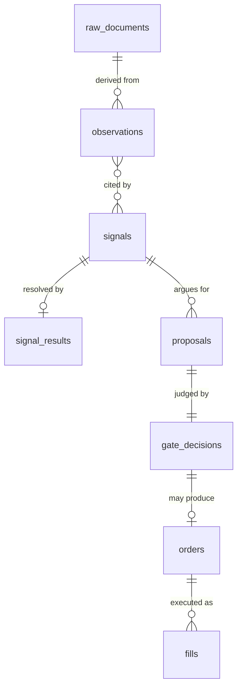

# Sonde — system overview

The single document to read for the whole picture. Everything here is summary; the authoritative
detail lives in [`architecture.md`](./architecture.md), [`strategy/`](./strategy), and the
[ADRs](./decisions).

---

## 1. What it is

Sonde watches public data sources, forms opinions about markets, and paper-trades on them — with
every step of its reasoning recorded and inspectable.

**The thesis in one sentence:** trade when _independent_ evidence agrees — a mandated disclosure, an
exogenous macro move, genuine unprompted attention — because any single source is either noise or
already priced.

**The primary goal is a system worth operating and watching, not a profitable one.** That ordering
is deliberate and stated ([`goals.md`](./goals.md)); it prevents backtest-driven development, which
for an LLM-based system produces numbers that mean nothing.

---

## 2. System at a glance



**The boundary between planes 2 and 3 is the whole design.** Everything above the gate is advisory.
The model emits a typed proposal into a function it does not control, and that function is plain
TypeScript with no network and no model in it. A hallucination, a misreading, or a successful prompt
injection produces a **rejected proposal and a log entry**, never a trade.

---

## 3. The four planes

### Collection

Probes are small, independent, single-purpose collectors. Each fetches, normalises, deduplicates,
and timestamps. **A probe never interprets** — it has no opinion, only provenance.

Two rules that everything downstream depends on:

- **Raw payloads are persisted before anything is derived from them**, content-hashed. Everything
  else can be rebuilt from that table, which is what makes replay and shadow analysts possible.
- **Two timestamps, always.** `occurredAt` is when the event happened; `observedAt` is when Sonde
  saw it. They are separate branded types in code, so swapping them is a compile error.

### Reasoning — advisory

Turns observations into typed `Signal` records. Two tiers, because inference is the only real cost:

| Tier      | Model     | Role                                                 |
| --------- | --------- | ---------------------------------------------------- |
| Triage    | Haiku 4.5 | Batched scoring of many items per call; filters hard |
| Deep read | Opus 5    | One call per formed thesis; produces the signal      |

A `Signal` without `rationale` and `sourceIds` fails schema validation. Not a convention — a
`ZodError`.

### Enforcement — deterministic

| Component  | Owns                                                                                                 |
| ---------- | ---------------------------------------------------------------------------------------------------- |
| Risk gate  | Position caps, daily loss halt, order rate, gap guard, sanity bounds, kill switch, dead-man's switch |
| Reconciler | Venue state is authoritative; local state is a cache to be corrected                                 |

`packages/risk` cannot import `packages/agents` — enforced by a lint rule that fails the build citing
the ADR it protects.

### Presentation — private

A Next.js dashboard, read-mostly, over the same Postgres. **Never publicly deployed** — venue terms
forbid redistributing market data ([ADR 0013](./decisions/0013-private-dashboard-public-repo.md)).
Derived artifacts — signals, rationale, calibration curves — are ours and publishable; quotes and
bars are not.

---

## 4. How evidence becomes a position



**Independence is causal, not categorical.** Two pieces of evidence corroborate when neither is
downstream of the other. Two insiders filing separately are independent decisions by different
people; a news article _about_ a filing is not. This was corrected during the trade walkthrough — the
original categorical rule would have counted a filing and the article about it as two sources.

### The evidence classes

| Class       | Source                                                 | Independence rests on                                |
| ----------- | ------------------------------------------------------ | ---------------------------------------------------- |
| `filing`    | SEC EDGAR — Form 4 (code `P` only), 8-K, congressional | Legally mandated, fixed clock, not derived from news |
| `editorial` | GDELT, RSS                                             | Reporting — _frequently derivative, often rejected_  |
| `attention` | Bluesky firehose, Reddit                               | The crowd — derivative portion must be netted out    |
| `macro`     | FRED, sector ETFs                                      | Entirely exogenous — modifier only                   |

---

## 5. The trading day

Crypto never closes, so event and price reaction are simultaneous — corroboration always arrives
after the move. US equities close, which hands the strategy a window nobody can trade in.



**The window is real and it is not free.** Seventeen hours to assemble a thesis, and then the market
reprices the asset before anyone can act. The gap guard rejects stale theses rather than chasing
them — and the most instructive path through the system ends in _not trading_, which is why
rejections are rendered next to fills.

Full minute-by-minute reasoning: [`strategy/anatomy-of-a-trade.md`](./strategy/anatomy-of-a-trade.md).

---

## 6. Position lifecycle



Rejected proposals are **scored anyway**. Whether the gap guard rejected trades that would have
worked is measurable, and it is the only way to tune the threshold on evidence rather than taste.

---

## 7. Data model



| Table              | Holds                                     | Mutability   |
| ------------------ | ----------------------------------------- | ------------ |
| `raw_documents`    | Content-hashed original payloads          | Immutable    |
| `observations`     | Normalised probe output                   | Immutable    |
| `signals`          | Analyst output with rationale and sources | Append-only  |
| `signal_results`   | Resolved outcome at horizon               | Written once |
| `proposals`        | Portfolio agent order proposals           | Append-only  |
| `gate_decisions`   | Accept/reject with reason                 | Append-only  |
| `orders` / `fills` | Submitted and executed                    | Append-only  |

**Append-only is a database trigger, not a convention.** `UPDATE` and `DELETE` raise, citing the ADR:

```
ERROR:  signals is append-only: UPDATE rejected. Insert a superseding row instead.
        See docs/decisions/0008-append-only-signal-log.md
```

Because LLM decisions cannot be backtested, the forward record is the only thing Sonde can ever be
judged on. It must not be editable by a migration, a stray `psql` session, or us.

---

## 8. Components

| Package         | Responsibility                                            | State                           |
| --------------- | --------------------------------------------------------- | ------------------------------- |
| `@sonde/core`   | Zod domain schemas — the single source of truth for types | **Built** — 21 tests            |
| `@sonde/db`     | Drizzle schema, migrations, point-in-time reads           | **Built** — 5 integration tests |
| `@sonde/probes` | Collectors, one module per source                         | Planned — M1                    |
| `@sonde/agents` | Analyst prompts, thesis builder, model routing            | Planned — M2                    |
| `@sonde/risk`   | The gate — deterministic, adversarially tested            | Planned — M4                    |
| `@sonde/venue`  | Alpaca adapter, idempotency, reconciliation               | Planned — M5                    |
| `apps/engine`   | The loop — probes, analysts, gate, reconciler             | Planned — M0                    |
| `apps/web`      | Private dashboard                                         | Planned — M0                    |

### Point-in-time reads

Everything an analyst sees goes through `asAnalystSaw(db, asOf)`. The timestamp is **required, not
defaulted** — there is no accidental path to "just read the table."

It filters on `observed_at`, never `occurred_at`. A bar that _closed_ in 2019 but was _imported_
today has a 2019 `occurred_at` and today's `observed_at`; filtering the intuitive way would look
correct and silently leak the future.

---

## 9. What is enforced structurally

Not documented — enforced, so violating it fails a build, a test, or a query.

| Invariant                      | Mechanism                                                 |
| ------------------------------ | --------------------------------------------------------- |
| The gate cannot reach a model  | `no-restricted-imports` lint rule citing ADR 0005         |
| Agents cannot reach a venue    | Same                                                      |
| Signals name their causes      | Zod `.min(1)` on `sourceIds`, non-empty `rationale`       |
| The record is not editable     | Postgres triggers on four tables                          |
| Timestamps cannot be swapped   | Separate branded types                                    |
| Money is never a float         | Branded decimal strings                                   |
| Analysts cannot see the future | `asAnalystSaw` requires an explicit `asOf`                |
| The gate stays readable        | Complexity capped at 8 in `packages/risk` vs 12 elsewhere |
| Execution stays on paper       | Venue adapter refuses to construct otherwise              |

---

## 10. Cost

Venue fees are zero by construction — paper only. **Inference is the sole recurring cost.**

| Model     | Input / 1M | Output / 1M | Role                 |
| --------- | ---------- | ----------- | -------------------- |
| Haiku 4.5 | $1         | $5          | Triage, batched      |
| Opus 5    | $5         | $25         | Deep read, proposals |

Target **under $30/month**, held by three levers: event-driven cadence rather than polling; tiered
escalation so Opus only sees formed theses; and prompt caching with the stable prefix at ~0.1× input
price.

> Minimum cacheable prefixes are **not monotonic** — 512 tokens on Opus 5 but **4096 on Haiku 4.5**.
> A short triage prompt on the cheap model silently caches nothing, with no error. Batching clears
> the floor.

---

## 11. Status

| Milestone        | Goal                                   | State       |
| ---------------- | -------------------------------------- | ----------- |
| 0 · Pipe         | Data flows end to end, no intelligence | In progress |
| 1 · Ears         | Unstructured sources, clean provenance | Planned     |
| 2 · Opinion      | First analyst, signals with reasoning  | Planned     |
| 3 · Scorekeeping | Resolve signals against reality        | Planned     |
| 4 · Gate         | Risk limits, adversarially tested      | Planned     |
| 5 · Hands        | Paper trading end to end               | Planned     |
| 6 · Watch        | Replay, cost dashboard, alerting       | Planned     |
| 7 · Iterate      | Prompt versioning, shadow analysts     | Planned     |

**Scoring is built before execution.** Measuring before acting is the only way this stays honest.

### Open assumptions

| ID     | Assumption                                           | Resolution                                    |
| ------ | ---------------------------------------------------- | --------------------------------------------- |
| A1     | Code-`P` Form 4s carry information                   | Scoreboard, months                            |
| A2     | Multi-insider clusters beat single filings           | Scoreboard, months                            |
| A3     | Derivative attention is separable                    | Needs real post data                          |
| **A4** | **Overnight gaps are small enough to trade through** | **Measurable now — highest-value next spike** |
| A5     | EDGAR `getcurrent` latency is seconds                | One afternoon of polling                      |

A4 is the one that could invalidate the strategy: if most filing-driven theses gap past the guard,
this does not work in its current form.

---

## 12. Where decisions live

Fourteen [ADRs](./decisions), append-only. The load-bearing ones:

| ADR                                                             | Decision                                                                       |
| --------------------------------------------------------------- | ------------------------------------------------------------------------------ |
| [0004](./decisions/0004-no-llm-backtests.md)                    | **No LLM backtests** — forward-testing only. Everything else follows from this |
| [0005](./decisions/0005-llm-proposes-code-disposes.md)          | The LLM proposes, deterministic code disposes                                  |
| [0003](./decisions/0003-paper-first-execution.md)               | Paper only; going live is an ADR, not a flag                                   |
| [0008](./decisions/0008-append-only-signal-log.md)              | Append-only record with mandatory provenance                                   |
| [0011](./decisions/0011-source-acquisition-policy.md)           | Source tiers; no adversarial scraping                                          |
| [0013](./decisions/0013-private-dashboard-public-repo.md)       | Dashboard private, repo public                                                 |
| [0014](./decisions/0014-equities-and-commodity-etfs-primary.md) | Equities and commodity ETFs; crypto is a testbed                               |

**Start with 0004.** The milestone ordering, the storage schema, and the entire scoring apparatus
follow from the fact that an LLM trader cannot be meaningfully backtested.
