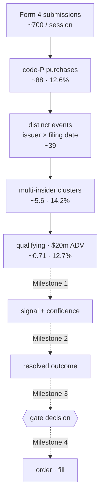

# First screen

**Status:** proposed · **Milestone:** 0 · **Consumes:** `@sonde/db` · **Constrained by:** [ADR 0013](../decisions/0013-private-dashboard-public-repo.md)

The one screen Milestone 0 ships. Written before `apps/web` exists because the choice of what it
shows determines what the engine has to record, and because the wrong first screen is the most
visible way to waste a milestone.

---

## The problem this screen has

At Milestone 0 there is no signal engine, no gate, no position, and no P&L. There are filings, price
bars, and job runs. The obvious screen — a live tape of filings scrolling past — is the wrong one,
and the [study](../research/insider-filing-gap-study.md) says precisely why.

Two years of measured data, per trading session:

| Stage                              | per session | of previous | why the drop                             |
| ---------------------------------- | ----------: | ----------: | ---------------------------------------- |
| Form 4 submissions seen            |        ~700 |           — | everything EDGAR publishes               |
| code-`P` open-market purchases     |         ~88 |       12.6% | the rest is compensation: `A`, `M`, `F`  |
| distinct (issuer, filing-date)     |         ~39 |       44.6% | collapse, not a filter                   |
| clusters of two or more insiders   |         ~5.6 |      14.2% | **the signal** — a lone buyer is nothing |
| passing the $20m ADV liquidity bar |        ~0.71 |      12.7% | below it the effect dilutes              |

**One filing in ~980 becomes a qualifying event.** A tape is not watchable at that ratio — the
interesting row is four screens above where you were looking, and the other 979 rows are indistinguishable
from it without opening each one.

Worse, the arrival rate makes a naive screen look broken. At 0.71 qualifying events per session,
**roughly 49% of sessions produce none at all.** A dashboard scoped to "today" is empty every other
day, and an empty dashboard is one you stop opening.

## D1 — The screen is the funnel, not the tape

Render the ratios above as the primary object. The funnel is what Sonde is doing; the filings are
just its input.



This does three things a tape cannot:

1. **It shows selectivity, which is the whole thesis.** The point of Sonde is that it throws away
   99.9% of what it reads. That is invisible in a list of what survived.
2. **It is never empty.** The top of the funnel has ~700 rows a day even when the bottom has zero.
3. **It is the drill-down target.** Every stage is a click into the rows at that stage, and every row
   is a click into its source filing — the two-click rule from [`README.md`](./README.md), satisfied
   structurally rather than by adding links later.

**And it is the screen that survives.** Each later milestone appends a stage rather than replacing
the layout: signal, outcome, gate, fill. By Milestone 4 this one screen is the entire pipeline end to
end, which is the "worth leaving open" criterion from [`goals.md`](../goals.md).

## D2 — Funnel counts are queries, never counters

Nothing on this screen reads an incrementing counter maintained by the engine. Every number is a
`SELECT … WHERE observed_at BETWEEN …` over rows that are already stored.

Counters drift, cannot be recomputed after a bug, and quietly disagree with the data they claim to
summarise. Queries over an append-only log have none of those failure modes, and they buy two things
for free:

- **Any historical window renders**, because the window is a parameter, not a reset. That is the seed
  of Milestone 5's replay with no extra machinery.
- **The screen cannot lie about the database**, because it has no state of its own to be wrong.

The cost is query load. At ~700 rows/session against indexed `observed_at`, this is not a
consideration for years.

> This makes a schema demand on the engine: the intermediate stages must be **stored, not just
> passed through**. A filing rejected for being code-`A` still gets an `observations` row, or stage two
> of the funnel has no denominator. Recording only what survives makes the interesting number
> — how much was discarded — unrecoverable.

## D3 — The funnel is the silent-failure detector

`job_runs` (engine spec [D5](../specs/engine-runtime.md)) catches jobs that **throw**. It cannot catch
a job that succeeds and is wrong — a parser change that silently stops recognising code-`P`, an ADV
computation reading a stale bar, an XML shape that shifts under us.

Every stage of this funnel has a **measured baseline** from the study. So show the observed ratio
against it:

| Stage transition       | Expected | Flag when                       |
| ---------------------- | -------: | ------------------------------- |
| submissions → code-`P` |    12.6% | outside roughly 8–18% for a day |
| events → multi-insider |    14.2% | outside roughly 10–19%          |
| multi-insider → liquid |    12.7% | outside roughly 8–18%           |

A code-`P` ratio of 0.2% is a broken parser, reported by a green job that ran fine. This is the
cheapest health check in the system: the numbers are already on screen, and the baselines already
exist because the research came first.

> The bands are **guesses** and marked as such — daily counts at n≈700 are noisy, and the right
> thresholds are a Milestone 1 measurement once there is live data to set them from. Flag, never
> halt: this is a yellow indicator on a dashboard, not a trading control.

## D4 — Each panel's window is set by its own arrival rate

Three panels, three scopes, because the underlying rates differ by three orders of magnitude:

| Panel             | Window                   | Why                                                                 |
| ----------------- | ------------------------ | ------------------------------------------------------------------- |
| Funnel            | **rolling 24h**          | not a calendar day — filings cluster 16:00–20:00 ET, so "today" is near-empty all morning |
| Qualifying events | **rolling 30 days**, 7/30/90 toggle | ~15 rows; at 7d it is ~3.5 rows and empty in ~3% of weeks |
| Probe health      | **now**, 24h sparkline   | the question is present-tense                                       |

A rolling 24h window is also the only one that is comparable at 09:00 and at 21:00. A calendar-day
funnel would show a ratio computed from 40 filings in the morning and 700 by evening, and the
morning number would be noise presented as fact.

## D5 — Poll. Liveness is freshness, not churn

The fastest-moving data on this screen changes every **5 minutes** (`edgar-live`). Job rows change
every 30s. Price bars change once a day.

WebSockets or SSE would be sub-second push for data that moves every five minutes.
[`architecture.md`](../architecture.md) says the engine "needs to hold WebSocket connections" — that
line was written for continuous crypto markets, the same assumption the engine spec removed from the
event bus. It does not survive the pivot either.

**Client polls every 15s.** The problem this creates is that a correct screen and a frozen screen look
identical for five minutes at a time. So the fix is not faster data, it is **visible age**:

- Every panel carries the age of its own data — `last poll 2m 14s ago`
- The header shows next-poll countdown, ticking client-side every second
- Age crossing 2× the job's cadence turns the panel amber; 4× turns it red

The screen feels alive because it shows its own heartbeat, not because rows fly past. This also means
a stalled engine is obvious within one cadence instead of being indistinguishable from a quiet market.

## D6 — The web app reads Postgres through a read-only role

No API layer between `apps/web` and the database at Milestone 0. Server components query the same
Postgres the engine writes. An HTTP API would be a second place to define every shape, for one
consumer, with no second consumer in sight.

The safety property that makes this fine is enforced structurally, not by convention:

```sql
CREATE ROLE sonde_web LOGIN PASSWORD :'pw';
GRANT CONNECT ON DATABASE sonde TO sonde_web;
GRANT USAGE ON SCHEMA public TO sonde_web;
GRANT SELECT ON ALL TABLES IN SCHEMA public TO sonde_web;
ALTER DEFAULT PRIVILEGES IN SCHEMA public GRANT SELECT ON TABLES TO sonde_web;
```

`apps/web` connects as `sonde_web`. It is not able to write, so it cannot corrupt the evidence base
by accident — the same reasoning as the append-only triggers, and **complementary to them**: those
triggers block `UPDATE`/`DELETE` on four tables but permit `INSERT`, and do not cover `candles` or
`job_runs`. The role covers what the triggers do not.

Every read goes through `asAnalystSaw` semantics — filtered on `observed_at`, never `occurred_at`.
The dashboard showing a filing before Sonde could have seen it would make every screenshot of it a
subtle lie about what was knowable when.

## D7 — No fake data, and it does not leave localhost

**Empty states state the expected rate rather than apologising.** "No qualifying events in the last 7
days. Expected rate is ~3.4/week; a quiet week is ~3% likely." That is informative, and it
distinguishes _nothing happened_ from _something is broken_ — which is the single most common
ambiguity in a low-event-rate dashboard.

**No placeholder charts, no seeded demo rows, ever.** A chart with sample data in it is a screen that
has told you one lie and may be telling you others.

[ADR 0013](../decisions/0013-private-dashboard-public-repo.md) binds the rest:

- The dev server binds `127.0.0.1` only. Milestone 0 has no auth because it has no network surface;
  auth is required before any deployment and is a Milestone 5 concern.
- Price bars are Alpaca's data. They render on the private dashboard freely and **must not appear in
  any screenshot committed to this repo.** The funnel's counts and ratios are Sonde's own artifacts
  over public SEC filings and are publishable without qualification. Per-ticker figures computed from
  bars — the `ADV $84m` in the event row — are derived rather than quoted, but sit close enough to the
  line that the safe rule is: **screenshots show the funnel, and redact the ADV column.**

## Layout

One page. No navigation at Milestone 0 — a nav bar over one screen is furniture.

```
┌────────────────────────────────────────────────────────────────────┐
│  sonde        market: closed · opens 09:30 ET in 4h 12m            │
│               edgar-live 2m 14s ago · next in 2m 46s · ✓ healthy   │
├────────────────────────────────────────────────────────────────────┤
│  FUNNEL — rolling 24h                                              │
│                                                                    │
│  submissions seen        712  ────────────────────────────────     │
│  code-P purchases         94  ████                    13.2%  ✓     │
│  distinct events          41  ██                      43.6%  ✓     │
│  multi-insider clusters    6  ▌                       14.6%  ✓     │
│  qualifying ($20m ADV)     1  ▏                       16.7%  ✓     │
├────────────────────────────────────────────────────────────────────┤
│  QUALIFYING EVENTS — 30d              [ 7d · 30d · 90d ]           │
│                                                                    │
│  ▸ 2026-08-28  ACME   3 insiders  $412k  SIC 3674  ADV $84m        │
│  ▸ 2026-08-26  ...                                                 │
├────────────────────────────────────────────────────────────────────┤
│  PROBES                                                            │
│  edgar-live       ✓  2m ago   712 seen · 94 code-P · no gap        │
│  edgar-reconcile  ✓  6h ago   870 indexed · 0 missed               │
│  alpaca-bars      ✓  14h ago  774 in universe                      │
└────────────────────────────────────────────────────────────────────┘
```

Interactions, and there are only three:

| Click                | Goes to                                                      |
| -------------------- | ------------------------------------------------------------ |
| A funnel stage       | The rows at that stage, paginated, newest first              |
| A qualifying event   | Expands in place: each insider, shares, price, filing link   |
| A probe row          | That job's last 20 `job_runs`, with errors                   |

## Acceptance

Milestone 0's exit criterion is "a filing cluster appearing in the UI within minutes of hitting
EDGAR, next to a price chart Sonde populated itself." Concretely:

- [ ] A filing published to EDGAR appears in the funnel's top stage within **10 minutes** (one poll
      interval plus render)
- [ ] Funnel stage counts equal a hand-run SQL query over the same window — **the screen and the
      database agree**
- [ ] Killing the engine turns the header amber within 10 minutes and red within 20, with no code
      path that special-cases it
- [ ] With zero qualifying events in the window, the screen states the expected rate rather than
      rendering blank
- [ ] `apps/web` cannot write: an attempted `INSERT` as `sonde_web` fails with a privilege error, and
      there is a test asserting it
- [ ] Every panel renders its own data age, and the ages are correct after a browser tab is
      backgrounded for an hour

## Open

- **Where does the price chart go?** Milestone 0's exit criterion names one, but a chart of _what_?
  There is no position to chart, and a chart of a random universe member is decoration. The honest
  candidate is the chart of the most recent qualifying event's issuer, which makes it a drill-down
  rather than a panel — but that leaves the price probe with no direct surface of its own beyond the
  `774 in universe` count. Unresolved; the count may genuinely be enough at Milestone 0.
- **Does the funnel need a "why rejected" breakdown?** Stage two discards ~87% of filings, and
  splitting that by transaction code (`A` / `M` / `F` / `S`) would be interesting and nearly free.
  Deferred as a nice-to-have that could easily eat the milestone.
- **Ratio bands are guesses.** Stated in D3, repeated here so it does not get lost: they need a
  Milestone 1 measurement against live daily counts.
